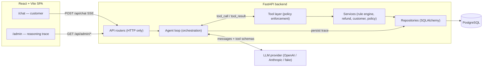

# Architecture

A bounded tool-calling loop. The agent advertises a fixed set of tools to the model, runs whichever tools the model chooses, feeds the results back, and repeats until the model emits a final text answer or the iteration cap is hit. Every iteration is persisted to the trace.

## Request lifecycle (happy path)

A customer message hits the `/api/chat` router, which loads the conversation and opens an SSE stream. The agent loop appends the user message, builds the provider message list (system prompt + history + any structured selection), and asks the model. The model proposes a tool — e.g. `verify_identity`, then `present_return_options`, then `process_refund`. Each tool runs through the validated tool boundary; `process_refund` **re-runs the rule engine** and only writes a refund on an `APPROVE` verdict. Every model turn, tool call, tool result, latency, and binding decision is written to `agent_steps`. The model then returns a natural-language reply. The admin dashboard can replay the entire trace afterward.

## Layering contract

The dependency rule is one-directional: outer layers import inner, never the reverse.

| Layer | Responsibility | Must NOT |
|---|---|---|
| **Routers** (`app/api`) | HTTP only: parse, validate, delegate, return. | Contain business logic. |
| **Agent** (`app/agent`) | Owns the LLM conversation loop, tool dispatch, SSE emission, trace writes. | Touch SQL directly or know policy rules. |
| **Tools** (`app/tools`) | Framework-agnostic adapters; validate input, call services, return structured JSON. **Policy is enforced here.** | Re-implement rules (they call the rule engine). |
| **Services** (`app/services`) | Business logic: rule engine, refund/customer/policy services. | Speak HTTP or call the LLM. |
| **Repositories** (`app/repositories`) | Data access only. | Hold business rules. |

Because the loop is a thin adapter over framework-agnostic tools and services, the orchestration framework could be swapped without touching the tools, services, or DB.

## Why raw function calling (not a framework)

The agent uses the provider's native tool-calling loop rather than LangGraph or CrewAI. Rationale: total transparency makes it trivial to log every step into `agent_steps` (which directly serves the admin dashboard); maximum control over the system prompt and the deterministic guard; the smallest image; and the easiest path to debug under adversarial tests. The cost is writing the loop, state, and retries by hand — but those are the lines reviewers want to read. The full comparison lives in [`design.md`](design.md) §4.5.

## Streaming and trace persistence (decoupled)

`/api/chat` streams over **Server-Sent Events**. Critically, **trace persistence is decoupled from the socket**: the agent loop writes each `messages` / `agent_steps` row as it executes, and the SSE emitter is a passive observer. The streaming router opens its own DB session and commits only after the turn finishes, so the per-item row lock spans the whole turn. If the client disconnects mid-stream, the loop runs to completion server-side and the trace plus any binding refund are still committed. The admin log is never dependent on a live socket.

See [`api-reference.md`](api-reference.md) for the SSE event vocabulary and [`agent-and-tools.md`](agent-and-tools.md) for the loop internals.
