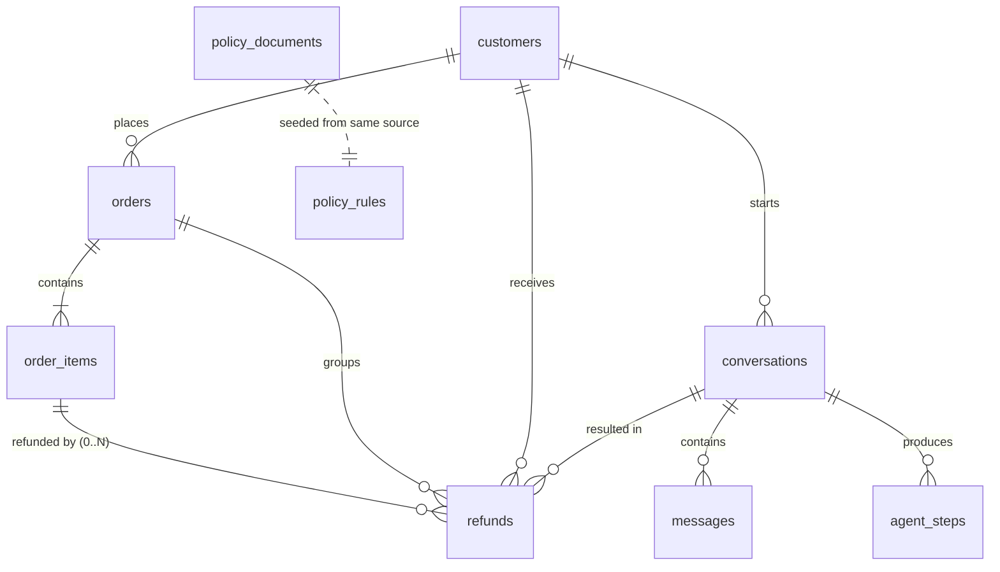

# Component Spec 01 — Database & Data Model

> Component #1 of 8. Foundation layer; every other component reads this schema.
> Engine: **PostgreSQL 16**. Access: SQLAlchemy ORM + Alembic migrations.
> Companion: `docs/design.md §3`, `docs/repo-structure.md §3`.
>
> **Model: refunds are per line item, with partial-quantity support.** Each `order_item` is refundable independently, on its own delivery date and return window. The order's refund state is *derived* from its item refunds, never stored.

---

## 1. Scope & responsibilities

This component owns:

- The relational schema (tables, types, constraints, indexes).
- Migrations (Alembic) that build that schema deterministically.
- Seeding (~15 customers + orders + policy), gated by `SEED_ENABLED`, idempotent.
- The **dual policy store** (prose for the LLM, structured rules for the guard) and its anti-drift guarantee.

It does **not** own business rules (rule engine, spec #2) or data-access call sites (repositories). This spec defines the *shape* and *invariants* of the data.

---

## 2. Conventions (apply to every table)

- **Primary keys**: `UUID`, default `gen_random_uuid()` (built into PG16).
- **Timestamps**: `TIMESTAMPTZ`, default `now()`. App works in UTC.
- **Money**: `NUMERIC(10,2)` — never float. `currency` `TEXT` default `'USD'` (single-currency v1).
- **Enumerations**: `TEXT` + `CHECK` constraint, not native PG `ENUM` (easier to amend; allowed set still centralized). Mirrored by SQLAlchemy/Pydantic enums in app code.
- **Foreign keys**: explicit, `ON DELETE` chosen per relationship, always indexed.
- **No soft deletes** in v1 — refunds and traces are append-only history.

---

## 3. Entity-relationship overview



Cardinality notes that carry weight:

- **`order_items → refunds` is 0..N.** A line item can be refunded across multiple requests (partial quantity), so there is no single-row uniqueness. Integrity is a *quantity* invariant instead: the sum of approved refunded units for an item never exceeds `order_items.quantity` (§7, enforced transactionally in spec #3).
- **The order has no stored refund status.** Whether an order is un-refunded / partially / fully refunded is **derived** by aggregating its item refunds at query time. Single source of truth, no drift.
- `conversations.customer_id` is **nullable**: a conversation exists before identity is verified, and is bound to a customer only once `verify_identity` succeeds. Every order/refund action gates on it being non-null.

---

## 4. Table definitions (DDL contract)

### 4.1 `customers`
```sql
CREATE TABLE customers (
  id            UUID PRIMARY KEY DEFAULT gen_random_uuid(),
  name          TEXT NOT NULL,
  email         TEXT NOT NULL UNIQUE,
  loyalty_tier  TEXT NOT NULL DEFAULT 'standard'
                  CHECK (loyalty_tier IN ('standard','gold','vip')),
  created_at    TIMESTAMPTZ NOT NULL DEFAULT now()
);
```
`email` is the identity handle used by `verify_identity`.

### 4.2 `orders`
```sql
CREATE TABLE orders (
  id            UUID PRIMARY KEY DEFAULT gen_random_uuid(),
  customer_id   UUID NOT NULL REFERENCES customers(id) ON DELETE RESTRICT,
  order_number  TEXT NOT NULL UNIQUE,                 -- human-facing, e.g. ORD-1042
  status        TEXT NOT NULL DEFAULT 'placed'
                  CHECK (status IN ('placed','shipped','partially_delivered','delivered','cancelled')),
  total_amount  NUMERIC(10,2) NOT NULL CHECK (total_amount >= 0),
  currency      TEXT NOT NULL DEFAULT 'USD',
  ordered_at    TIMESTAMPTZ NOT NULL
);
CREATE INDEX ix_orders_customer_id ON orders(customer_id);
```
Changes from the order-level model: **`delivered_at` removed** (delivery is now per item, §4.3). `status` is a coarse **fulfillment** lifecycle only — it has **no `refunded` value** and is **not read by the rule engine**; refund state lives in `refunds` and is derived. `total_amount` is the sum of item line totals at order time (used only for display, not for refund math).

### 4.3 `order_items`
```sql
CREATE TABLE order_items (
  id                  UUID PRIMARY KEY DEFAULT gen_random_uuid(),
  order_id            UUID NOT NULL REFERENCES orders(id) ON DELETE CASCADE,
  product_name        TEXT NOT NULL,
  sku                 TEXT NOT NULL,
  category            TEXT,
  quantity            INT NOT NULL CHECK (quantity > 0),
  unit_price          NUMERIC(10,2) NOT NULL CHECK (unit_price >= 0),
  is_final_sale       BOOLEAN NOT NULL DEFAULT FALSE,   -- never refundable
  return_window_days  INT NOT NULL DEFAULT 30 CHECK (return_window_days >= 0),
  delivered_at        TIMESTAMPTZ                        -- NULL until THIS item is delivered
);
CREATE INDEX ix_order_items_order_id ON order_items(order_id);
```
The line item is the unit of refund eligibility. Its own `delivered_at`, `return_window_days`, and `is_final_sale` are the inputs the rule engine consumes — **per item**, independent of siblings. An item with `delivered_at IS NULL` is not yet returnable. `unit_price` × refunded units = refund amount.

### 4.4 `refunds`
A refund row is a **terminal decision on a request for N units of one line item**.
```sql
CREATE TABLE refunds (
  id              UUID PRIMARY KEY DEFAULT gen_random_uuid(),
  order_id        UUID NOT NULL REFERENCES orders(id) ON DELETE RESTRICT,         -- denormalized for fast per-order aggregation
  order_item_id   UUID NOT NULL REFERENCES order_items(id) ON DELETE RESTRICT,
  customer_id     UUID NOT NULL REFERENCES customers(id) ON DELETE RESTRICT,
  conversation_id UUID REFERENCES conversations(id) ON DELETE SET NULL,
  quantity        INT NOT NULL CHECK (quantity > 0),    -- units this request covers
  amount          NUMERIC(10,2) NOT NULL CHECK (amount >= 0),  -- unit_price * quantity
  status          TEXT NOT NULL
                    CHECK (status IN ('approved','denied','escalated')),
  reason_code     TEXT NOT NULL,                        -- machine code from rule engine (spec #2 §3.3)
  reason          TEXT,                                 -- human-readable rationale
  policy_refs     JSONB NOT NULL DEFAULT '[]',           -- rule keys that applied
  decided_by      TEXT NOT NULL CHECK (decided_by IN ('agent','human')),
  created_at      TIMESTAMPTZ NOT NULL DEFAULT now()
);
CREATE INDEX ix_refunds_order_id ON refunds(order_id);
CREATE INDEX ix_refunds_order_item_id ON refunds(order_item_id);
CREATE INDEX ix_refunds_customer_id ON refunds(customer_id);
CREATE INDEX ix_refunds_status ON refunds(status);
```

Key points:

- **Only `status='approved'` consumes units** and moves money. `denied` / `escalated` rows record the decision for audit but consume nothing.
- **No `UNIQUE(order_id)` or `UNIQUE(order_item_id)`** — partial quantity means multiple legitimate refunds per item. Integrity is the quantity invariant in §7, enforced in a row-locked transaction (spec #3), not by a unique index.
- `order_id` is denormalized onto the row so the **projected cumulative per-order threshold** (sum of approved `amount` for an order) is a single indexed aggregation — no join through `order_items`.
- The per-order $500 escalation test (spec #2) reads `SUM(amount) WHERE order_id = ? AND status = 'approved'` and adds the current request amount *before* confirming.

### 4.5 `conversations`
```sql
CREATE TABLE conversations (
  id           UUID PRIMARY KEY DEFAULT gen_random_uuid(),
  customer_id  UUID REFERENCES customers(id) ON DELETE SET NULL,   -- NULL until verified
  status       TEXT NOT NULL DEFAULT 'active'
                 CHECK (status IN ('active','resolved','escalated')),
  created_at   TIMESTAMPTZ NOT NULL DEFAULT now()
);
```

### 4.6 `messages`
```sql
CREATE TABLE messages (
  id               UUID PRIMARY KEY DEFAULT gen_random_uuid(),
  conversation_id  UUID NOT NULL REFERENCES conversations(id) ON DELETE CASCADE,
  role             TEXT NOT NULL CHECK (role IN ('system','user','assistant','tool')),
  content          TEXT,
  created_at       TIMESTAMPTZ NOT NULL DEFAULT now()
);
CREATE INDEX ix_messages_conversation_id ON messages(conversation_id, created_at);
```

### 4.7 `agent_steps` (the reasoning trace)
```sql
CREATE TABLE agent_steps (
  id               UUID PRIMARY KEY DEFAULT gen_random_uuid(),
  conversation_id  UUID NOT NULL REFERENCES conversations(id) ON DELETE CASCADE,
  message_id       UUID REFERENCES messages(id) ON DELETE SET NULL,
  step_no          INT NOT NULL,
  type             TEXT NOT NULL
                     CHECK (type IN ('model_text','tool_call','tool_result','decision')),
  tool_name        TEXT,
  tool_input       JSONB,
  tool_output      JSONB,
  latency_ms       INT,
  created_at       TIMESTAMPTZ NOT NULL DEFAULT now(),
  UNIQUE (conversation_id, step_no)
);
CREATE INDEX ix_agent_steps_conversation_id ON agent_steps(conversation_id, step_no);
```
Data source for the admin dashboard (F11/F12). Written by the agent loop, decoupled from the SSE socket (design.md §5.3).

### 4.8 `policy_documents`
```sql
CREATE TABLE policy_documents (
  id             UUID PRIMARY KEY DEFAULT gen_random_uuid(),
  version        INT NOT NULL UNIQUE,
  body_markdown  TEXT NOT NULL,
  created_at     TIMESTAMPTZ NOT NULL DEFAULT now()
);
```
Prose policy the LLM reads via `get_policy`. v1 seeds version `1`.

### 4.9 `policy_rules`
```sql
CREATE TABLE policy_rules (
  id           UUID PRIMARY KEY DEFAULT gen_random_uuid(),
  key          TEXT NOT NULL UNIQUE,
  value        JSONB NOT NULL,
  description  TEXT
);
```
v1 seed:

| key | value | meaning |
|-----|-------|---------|
| `escalation_threshold_usd` | `500` | if **projected per-order refund total** (prior approved on order + current request) **>** this, escalate |
| `default_return_window_days` | `30` | fallback window when an item has none |
| `final_sale_refundable` | `false` | final-sale items are never refundable |
| `dispute_email` | `"disputes@refundagent.example"` | address the agent gives on a denial for async dispute (§8). Placeholder, TBD |

`dispute_email` is a display/contact value, not enforcement logic, but lives here (and in the prose doc) so it stays single-sourced.

---

## 5. Dual policy store & anti-drift guarantee

`policy_documents.body_markdown` (prose, for the model) and `policy_rules` (structured, for the guard) are **both generated from one source**: `apps/backend/app/seed/policy_source.py`. It defines the rule constants and prose template once; seeding writes both tables from it. Changing a constant changes both outputs, so the text the model cites and the values the code enforces can never disagree.

Required policy-doc statements (at minimum): final-sale items are non-refundable; an item is refundable only after **its** delivery and within **its** return window measured from **its** delivery date; each item is refundable independently and in whole or partial quantity; refunds are processed when the projected total refunded on the order stays at or below $500, otherwise the request is escalated to a human; customers may only act on their own orders; an item's already-refunded units cannot be refunded again; a denied request is final within chat but may be disputed asynchronously by emailing `dispute_email`.

---

## 6. Seeding — fixture matrix (the part that earns eval points)

Idempotent (skip if `customers` non-empty), runs at backend startup only when `SEED_ENABLED=true`. **15 customers**: 8 carrying the named fixtures below, 7 fillers with plain varied orders. The per-item model lets a single multi-item order demonstrate several branches at once.

| Fixture | Setup | Expected outcome | Proves |
|---------|-------|------------------|--------|
| Happy item | item delivered 5d ago, $120, not final sale | **APPROVE** | normal per-item flow |
| Final-sale item | one item `is_final_sale=true` ($80) alongside a normal item | that item **DENY**, sibling still **APPROVE** | independence + final-sale |
| Window-expired item | delivered 60d ago, 30-day window | **DENY** (window) | per-item window |
| Undelivered item | `delivered_at` NULL, order `shipped` | **NEEDS_INFO** (not delivered) | per-item delivery gate |
| Mixed delivery order | item A delivered (refundable), item B not yet | A **APPROVE**, B **NEEDS_INFO** | independent delivery dates |
| Partial quantity | line of qty 3, customer returns 1, later returns 1 | both **APPROVE**, 1 unit remains | partial-qty invariant |
| Fully refunded item | line already fully refunded (approved rows = quantity) | **DENY** (nothing left) | quantity exhaustion |
| Over-threshold order | items that, summed, project **> $500** on the tipping request | **ESCALATE** the request that crosses | projected per-order threshold |
| Boundary order | refunds projecting to exactly **$500.00** | **APPROVE** (rule is strictly `>`) | boundary correctness |
| Wrong owner | order belongs to customer B; tester verifies as A | **DENY** (ownership) | identity binding |

Dates are **relative to `now()` at seed time** (e.g. `now() - interval '60 days'`) so age-based fixtures stay valid whenever the demo runs.

---

## 7. Invariants (must always hold)

1. **Quantity invariant**: for each `order_item`, `SUM(refunds.quantity WHERE status='approved') <= order_items.quantity`. Enforced in a row-locked transaction at refund time (spec #3); optionally backstopped by a DB trigger (noted, not required).
2. `refunds.amount = order_items.unit_price * refunds.quantity` for every row.
3. An order's refund state (none / partial / full) is **derived** from its item refunds; it is never stored on `orders`.
4. `agent_steps` for a conversation form a gapless, ordered sequence by `step_no`.
5. Any `refunds` row with `decided_by='agent'` was produced through the rule engine — the API never inserts refunds directly (repository discipline, spec #2/#3).
6. `policy_documents` and `policy_rules` were seeded from the same `policy_source` run.

---

## 8. Edge cases, failure modes & explicit non-goals

- **Partial-quantity returns**: in scope. A line of qty N can be refunded across multiple requests until cumulative approved units = N. The quantity invariant (§7) is the guard; it is checked under a row lock so two concurrent requests can't over-refund.
- **Re-requesting after a DENY**: denials are deterministic — re-asking a denied item (final sale, window expired, ownership) yields the same verdict from the pure rule engine, so the outcome is stable without a structural lock. v1 behaviour: the tool detects a prior terminal denial for the item and returns it, directing the customer to the **async dispute channel** (`policy_rules.dispute_email`) rather than re-deciding. This blocks "ask until yes." A *new request for still-available units* on an item that was only partially refunded is **not** a denial re-attempt and is allowed.
- **Item not yet delivered (`delivered_at` NULL)**: window can't start → `NEEDS_INFO`, no refund row written, re-evaluable after delivery.
- **Per-order escalation threshold**: computed as `prior_approved_total(order) + current_request_amount`; if `> escalation_threshold_usd` the **current** request escalates — so even a single first request over $500 escalates. Evaluated before the refund is confirmed.
- **Concurrency**: two requests racing on the same item are serialized by `SELECT ... FOR UPDATE` on the item row inside the refund transaction; the quantity invariant is re-checked after acquiring the lock. No over-refund possible.
- **Money precision**: `NUMERIC` only, everywhere.
- **Timezone**: all `TIMESTAMPTZ`; age computed in UTC; seed uses interval arithmetic.
- **Out of scope**: cross-order cumulative limits (threshold is per order), restocking fees, exchange/replacement flows, multi-currency.

---

## 9. Migrations & ownership

- **Alembic**, single initial migration: all tables, indexes, checks. Runs at backend startup before seeding.
- **Seeding is separate** (`seed/seed.py`), data-only — never mixed with DDL.
- SQLAlchemy models mirror the DDL; `alembic check` (in `make lint`) asserts models == migration head.

---

## 10. Feature traceability

F2 (identity), F3 (CRM tables, now with per-item delivery), F4 (`policy_documents`), F6 (`policy_rules`), F7 (`refunds` + quantity invariant), F10 (`conversations`/`messages`), F11/F12 (`agent_steps`), F13 (`refunds` audit incl. denials/escalations), F14 (§6 seeding), and the `SEED_ENABLED` half of F16.

---

## 11. Resolved decisions

1. **Refund granularity** — per line item, items refundable independently.
2. **Partial quantity** — allowed; integrity via the quantity invariant (§7), not a unique index.
3. **Delivery** — per item (`order_items.delivered_at`); an item isn't returnable until delivered.
4. **Return window** — per item, from that item's delivery date.
5. **Escalation threshold** — per order, on the **projected** cumulative refund (prior approved + current request), tested before confirming.
6. **Order refund status** — derived from item refunds, not stored.
7. **`order_number`** — `ORD-1042` style.
8. **Customers** — 15 total (8 named fixtures + 7 fillers).
9. **Re-request after denial** — terminal in chat, directed to `dispute_email`.
