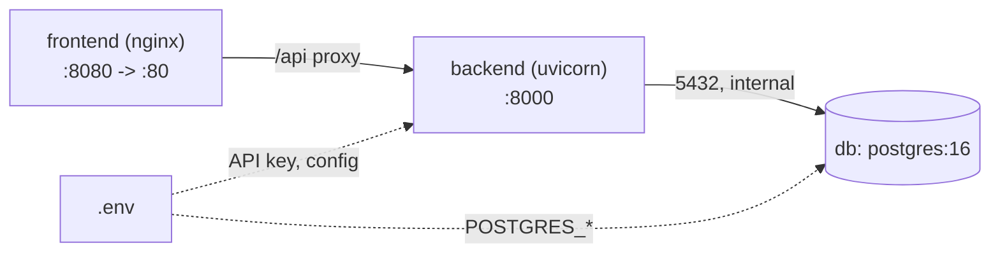

# Component Spec 07 — Infrastructure (Compose, Seeding, Config, README)

> Component #7 of 8. Containerization and the single-command setup that the challenge grades as "works out of the box, zero config errors."
> Lives at repo root: `docker-compose.yml`, `infra/docker/*`, `infra/nginx/nginx.conf`, `.env.example`, `Makefile`, `README.md`.
> Companions: `docs/design.md §7`, `docs/repo-structure.md §7`, `docs/components/01-database.md §9`, `05-backend-api.md §6`.

---

## 1. Scope & responsibilities

This component makes `docker-compose up` bring the whole system online deterministically: database, backend (with migrations + conditional seeding on startup), and the frontend served behind nginx with SSE-safe proxying. It owns env/config, healthcheck gating, the startup lifecycle, and the README.

The eval bar is **zero-config correctness**: a fresh clone + one API key + one command must work. Every choice below serves that.

---

## 2. Services (`docker-compose.yml`)



| service | image / build | ports | depends_on | healthcheck |
|---------|---------------|-------|------------|-------------|
| `db` | `postgres:16` | internal only (not published) | — | `pg_isready` |
| `backend` | build `infra/docker/backend.Dockerfile` | `8000:8000` | `db: service_healthy` | `GET /api/health` |
| `frontend` | build `infra/docker/frontend.Dockerfile` (multi-stage → nginx) | `8080:80` | `backend: service_healthy` | `wget -q --spider /` |

- **db is not published** to the host — nothing outside the compose network needs it; reduces footprint and avoids port clashes. (A commented-out `5432:5432` line in the file for opt-in debugging.)
- **Named volume** `pg_data` for Postgres persistence; everything else is stateless.
- Single user-defined bridge network; services address each other by name (`db`, `backend`).
- `depends_on: condition: service_healthy` chains startup: db ready → backend ready → frontend. This is what makes the first `up` reliable instead of racy.

---

## 3. Backend startup lifecycle

The backend container's entrypoint runs in strict order before serving:

```
1. wait for db        # belt-and-suspenders; compose healthcheck already gates this
2. alembic upgrade head   # schema migrations (idempotent)
3. if SEED_ENABLED: seed  # data-only, idempotent (skips if customers exist)
4. exec uvicorn           # serve
```

- Migrations and seeding are **separate** (DDL vs data) per DB spec §9.
- A failure in step 2 or 3 **fails the container fast with a clear log** rather than serving a half-built system — better a visible error than silent corruption.
- Seeding is idempotent and gated by `SEED_ENABLED` (default `true`); a restart re-runs the entrypoint without duplicating data.
- The app **boots even without an LLM key**; `/api/health` reports `llm_configured:false` and chat returns a clean error until a key is supplied (spec #5 §6). This keeps the container "up" for the reviewer even before they paste a key.

---

## 4. Dockerfiles (`infra/docker`)

- **`backend.Dockerfile`** — slim Python base, install from a locked dependency file (`pyproject.toml` + lock), copy app, non-root user, entrypoint = the §3 lifecycle script. No dev deps in the runtime image.
- **`frontend.Dockerfile`** — multi-stage: stage 1 `node` builds the Vite bundle (using the **committed** generated API client, so the build never depends on a live backend or codegen step); stage 2 copies the static `dist/` into `nginx`. Small final image, no Node at runtime.

`.dockerignore` excludes `node_modules`, `.venv`, `.git`, tests, and docs from build context.

---

## 5. nginx (`infra/nginx/nginx.conf`)

Serves the SPA and reverse-proxies the API. The SSE settings are the part that's easy to get wrong:

```
location /api/ {
    proxy_pass http://backend:8000;
    proxy_http_version 1.1;
    proxy_set_header Connection "";
    proxy_buffering off;            # <-- critical: stream SSE, don't buffer
    proxy_cache off;
    proxy_read_timeout 1h;          # long-lived chat streams
    chunked_transfer_encoding on;
}
location / {
    try_files $uri $uri/ /index.html;   # SPA history fallback
}
```

`proxy_buffering off` plus the backend's `X-Accel-Buffering: no` (spec #5 §3.2) is what keeps the token stream live through the proxy. Without it, the agent appears to "hang" then dump everything at once.

---

## 6. Configuration & secrets

- `.env` at the repo root is read by compose and injected into `backend` (config) and `db` (`POSTGRES_*`). It is **git-ignored**; `.env.example` is committed and documents every variable.
- The single thing a reviewer must provide is an API key (`OPENAI_API_KEY` for the default provider, or set `LLM_PROVIDER=anthropic` + `ANTHROPIC_API_KEY`).
- No secrets are baked into images or committed. v1 uses `.env`, not a secrets manager — adequate for a local demo, called out as a non-production choice in the README.

Consolidated env (matches `repo-structure §6`):

| var | default | purpose |
|-----|---------|---------|
| `LLM_PROVIDER` | `openai` | `openai` \| `anthropic` |
| `OPENAI_API_KEY` / `ANTHROPIC_API_KEY` | — | provider key (one required to chat) |
| `LLM_MODEL` | per-provider default | optional override |
| `LLM_TEMPERATURE` | `0` | decision consistency |
| `LLM_MAX_TOKENS` | `1024` | per-turn cap |
| `MAX_AGENT_ITERATIONS` | `8` | loop bound (fail-closed) |
| `HISTORY_LIMIT` | `-1` | prior messages per turn; -1 = unlimited |
| `SEED_ENABLED` | `true` | seed on startup |
| `FRONTEND_ORIGIN` | `http://localhost:8080` | CORS allow-list |
| `POSTGRES_USER/PASSWORD/DB` | `refund/refund/refund` | local db creds |

---

## 7. README plan (a graded deliverable)

Sections, in order:

1. **What it is** — one-paragraph overview.
2. **Prerequisites** — Docker + Docker Compose; an OpenAI or Anthropic API key.
3. **Run** — `cp .env.example .env`, paste the key, `docker-compose up --build`.
4. **URLs** — customer chat `http://localhost:8080/chat`, admin `…/admin`, API docs `http://localhost:8000/docs`.
5. **Architecture overview** — the agent loop, and the core principle: **the LLM orchestrates; deterministic code authorizes** (every refund re-validated by the rule engine in the tool layer). A short diagram. Pointer to `docs/`.
6. **Agent resilience** — how prompt injection is handled (enforcement matrix, spec #3 §5) and how to run the adversarial suite (`make test-adv`, spec #8).
7. **Configuration** — the env table (§6).
8. **Known gaps / non-goals** — no admin auth; dispute-email **receipt/processing** is out of scope (the agent only hands out the address); not production-hardened (no TLS, `.env` secrets, single node). Honesty here scores well.

---

## 8. Robustness checklist (maps to "works out of the box")

- Healthcheck-gated startup order (no races on first `up`).
- Migrations auto-run; idempotent seed; fast-fail on setup errors with clear logs.
- Committed generated client → frontend build never needs a live backend.
- App boots without an API key; clear runtime error, no crash loop.
- Pinned base images + dependency locks → reproducible builds.
- db unpublished; CORS locked to the frontend origin.
- `make up` / `make down -v` for clean re-runs.

---

## 9. Relationship to other components

- Runs the **backend (#5)** and its **startup lifecycle** that builds the **DB (#1)** and seeds it.
- Serves the **frontend (#6)** and proxies its API + SSE calls.
- `make test` / `make test-adv` run the backend tests and the **adversarial suite (#8)**.

---

## 10. Resolved decisions

1. **Host ports** — frontend `8080`, backend `8000`, db unpublished (commented opt-in line for debugging).
2. **Documented command** — `docker-compose up --build`; a fresh clone always rebuilds.
3. **README** — single root `README.md` with the §7 sections, linking to `docs/` for depth (architecture overview kept brief, not fully inlined).
