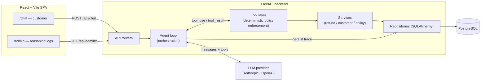
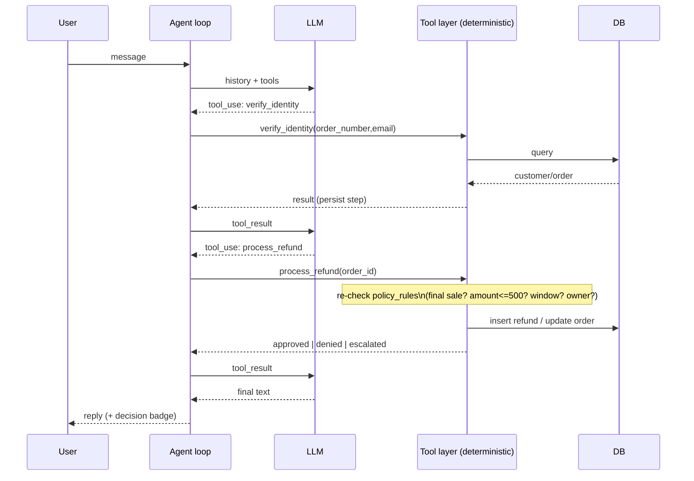
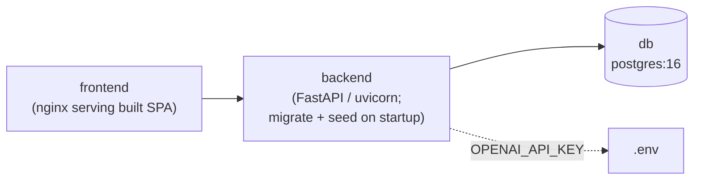

# Refund Agent — Application Design

> AI customer-support agent that approves, denies, or escalates e-commerce refunds.
> Stack: **FastAPI** (backend + agent) · **React + Vite** (frontend) · **PostgreSQL** (data) · **Docker Compose** (one-command run).
> Status: design only. No code yet.

---

## 0. Guiding principle (read this first)

The single most important architectural decision: **the LLM orchestrates, it does not authorize.**

The model decides *which tools to call and what to say*. It never has the final word on whether a refund is legal. Every state-changing tool (`process_refund`, `escalate`) **re-validates the request against policy in deterministic Python code** before doing anything. If a jailbroken model calls `process_refund` on a final-sale item or a $900 order, the tool itself rejects it.

This is what makes the system resilient to prompt injection: the attack surface for "trick the AI into refunding" is reduced to "trick deterministic code with hard-coded rules," which is not possible through chat. The eval criteria explicitly weight *agent resilience* and *separation of concerns* — this principle is how we win both.

---

## 1. Feature list

### Core (required to be "finished")

| # | Feature | Component(s) |
|---|---------|--------------|
| F1 | Customer chat — conversational refund requests | Frontend, Backend, AI |
| F2 | Identity / order verification before any action | Backend, AI, DB |
| F3 | CRM lookup tool (customer + order history) | AI, Backend, DB |
| F4 | Policy lookup / retrieval tool | AI, Backend, DB |
| F5 | Refund decision engine — APPROVE / DENY / ESCALATE / NEEDS_INFO | Backend, AI |
| F6 | Deterministic policy enforcement in tool layer (server-side re-validation) | Backend |
| F7 | Process-refund tool (idempotent state change) | Backend, DB |
| F8 | Escalate-to-human tool (>$500, ambiguity) | Backend, DB |
| F9 | Prompt-injection / jailbreak resilience | AI, Backend |
| F10 | Conversation + message persistence | Backend, DB |
| F11 | Agent reasoning trace capture (every step, tool call, latency) | Backend, DB |
| F12 | Admin dashboard — conversation list + reasoning trace viewer | Frontend, Backend |
| F12b | Streaming agent responses (SSE) — trace persisted independent of stream | Frontend, Backend, AI |
| F13 | Refund audit log (who/what/why/when) | Backend, DB, Frontend |
| F14 | Synthetic data: ~15 customers + orders + policy doc | DB |
| F15 | Single-command containerized setup + README | Infra |
| F16 | API-key configuration (Anthropic/OpenAI) via env | Infra, Backend |

### Stretch (do if time allows — flag for the reviewer)

| # | Feature | Notes |
|---|---------|-------|
| S2 | Live metrics (approval / denial / escalation rates) | Admin dashboard widget |
| S3 | Policy versioning | `policy_documents.version` already in schema |
| S4 | Rate limiting / abuse throttle | Per-session message cap |
| S5 | Provider abstraction (swap Anthropic ↔ OpenAI) | Single `LLMClient` interface |
| S6 | Eval harness — adversarial test suite | Strongly recommended; doubles as resilience proof |

### Out of scope (documented non-goals)

- **Dispute email processing.** On a denial, the agent directs the customer to an async dispute address (`policy_rules.dispute_email`). This is now a real product surface: the rule engine (spec #2) returns it in the denial outcome, the agent (spec #4) surfaces it in the denial message, and the README documents "email disputes" as the human-handled path. **Actually receiving or processing those emails is out of scope for this build** — there is no mail handler, inbox, or ticketing integration. This is flagged as a non-goal in the README so reviewers don't expect one.
- **Admin authentication** (see §5.2) — documented gap, not built.

> **Scope update:** refunds are **per line item** with **partial-quantity** support (each item refundable independently, on its own delivery + return window). Partial/multi-item refunds are therefore **in scope**, not a non-goal. The $500 escalation threshold is evaluated on the **projected cumulative refund per order** (prior refunds on the order + the current request) *before* the refund is confirmed. See `docs/components/01-database.md` and `02-policy-rule-engine.md` for the authoritative model.

---

## 2. High-level architecture



Request lifecycle (happy path): customer message → router → agent loop → LLM proposes `lookup_order` → tool runs, returns data → LLM proposes `process_refund` → tool **re-validates against policy**, performs refund, writes audit row → LLM returns natural-language confirmation → every step persisted to the trace table → response returned to chat; admin can replay the whole trace.

### Separation of concerns (the layering contract)

- **Routers** — HTTP only. Parse, validate, delegate. No business logic.
- **Agent** — owns the LLM conversation loop and tool dispatch. Knows nothing about SQL.
- **Tools** — thin, framework-agnostic adapters. Validate inputs, call services, return structured JSON. **This is where policy is enforced.**
- **Services** — business logic (eligibility rules, refund processing). No HTTP, no LLM.
- **Repositories** — data access only. No business rules.

This means the agent framework can be swapped (see §5.3) without touching tools, services, or the DB.

---

## 3. Database design (PostgreSQL)

### 3.1 HLD

Three logical groups:

1. **CRM / commerce** (seeded, read-mostly): `customers`, `orders`, `order_items`.
2. **Refund state** (written by the agent): `refunds`.
3. **Conversation + observability** (written by the agent): `conversations`, `messages`, `agent_steps`.
4. **Policy** (seeded): `policy_documents` + `policy_rules` (structured, machine-checkable).

Policy is stored **twice on purpose**: the full text doc (`policy_documents`) is what the LLM reads for reasoning/citation; the structured `policy_rules` (thresholds, flags) is what deterministic code enforces. Text is for the model, structure is for the guard. They must be kept consistent at seed time.

### 3.2 LLD — schema

> **Authoritative source:** `docs/components/01-database.md`. The sketch below is the HLD overview and reflects the **per-item** refund model (per-item delivery/window, partial quantity, per-order projected threshold, derived order refund state). On any discrepancy, the component spec wins.

```sql
customers (
  id              UUID PK,
  name            TEXT NOT NULL,
  email           TEXT UNIQUE NOT NULL,
  loyalty_tier    TEXT,                      -- standard | gold | vip
  created_at      TIMESTAMPTZ DEFAULT now()
)

orders (
  id              UUID PK,
  customer_id     UUID FK -> customers.id,
  order_number    TEXT UNIQUE NOT NULL,      -- human-facing, e.g. ORD-1042
  status          TEXT NOT NULL,             -- placed | shipped | partially_delivered | delivered | cancelled (fulfillment only; NO refund state)
  total_amount    NUMERIC(10,2) NOT NULL,
  currency        TEXT DEFAULT 'USD',
  ordered_at      TIMESTAMPTZ NOT NULL
)                                            -- refund state is DERIVED from item refunds, not stored

order_items (
  id              UUID PK,
  order_id        UUID FK -> orders.id,
  product_name    TEXT NOT NULL,
  sku             TEXT NOT NULL,
  category        TEXT,
  quantity        INT NOT NULL,
  unit_price      NUMERIC(10,2) NOT NULL,
  is_final_sale   BOOLEAN DEFAULT FALSE,     -- policy: never refundable
  return_window_days INT DEFAULT 30,
  delivered_at    TIMESTAMPTZ                -- per-item delivery; NULL until delivered
)

refunds (                                    -- per line item, partial quantity
  id              UUID PK,
  order_id        UUID FK -> orders.id,      -- denormalized for per-order threshold aggregation
  order_item_id   UUID FK -> order_items.id,
  customer_id     UUID FK -> customers.id,
  quantity        INT NOT NULL,              -- units this request covers
  amount          NUMERIC(10,2) NOT NULL,    -- unit_price * quantity
  status          TEXT NOT NULL,             -- approved | denied | escalated
  reason_code     TEXT NOT NULL,
  reason          TEXT,                      -- agent rationale
  policy_refs     JSONB,                     -- which rules applied
  decided_by      TEXT NOT NULL,             -- agent | human
  conversation_id UUID FK -> conversations.id,
  created_at      TIMESTAMPTZ DEFAULT now()
)                                            -- no UNIQUE(order_id/order_item_id); integrity = quantity invariant under row lock

conversations (
  id              UUID PK,
  customer_id     UUID FK -> customers.id NULL,  -- null until identity verified
  status          TEXT NOT NULL,             -- active | resolved | escalated
  created_at      TIMESTAMPTZ DEFAULT now()
)

messages (
  id              UUID PK,
  conversation_id UUID FK -> conversations.id,
  role            TEXT NOT NULL,             -- system | user | assistant | tool
  content         TEXT,
  created_at      TIMESTAMPTZ DEFAULT now()
)

agent_steps (                                -- the reasoning trace
  id              UUID PK,
  conversation_id UUID FK -> conversations.id,
  message_id      UUID FK -> messages.id NULL,
  step_no         INT NOT NULL,
  type            TEXT NOT NULL,             -- model_text | tool_call | tool_result | decision
  tool_name       TEXT,
  tool_input      JSONB,
  tool_output     JSONB,
  latency_ms      INT,
  created_at      TIMESTAMPTZ DEFAULT now()
)

policy_documents (
  id              UUID PK,
  version         INT NOT NULL,
  body_markdown   TEXT NOT NULL,
  created_at      TIMESTAMPTZ DEFAULT now()
)

policy_rules (                               -- machine-enforced
  id              UUID PK,
  key             TEXT UNIQUE NOT NULL,      -- e.g. escalation_threshold_usd
  value           JSONB NOT NULL,            -- e.g. 500
  description     TEXT
)
```

Key constraints that do real work: the **quantity invariant** (`SUM(approved refund units) ≤ order_items.quantity`, enforced under a `SELECT … FOR UPDATE` row lock) prevents over-refunds even under retries, races, or a confused model; `conversations.customer_id` gates every order action on a verified identity; per-item `delivered_at` and `return_window_days` drive per-item eligibility.

### 3.3 Seeding

Seeding runs at backend startup (gated by `SEED_ENABLED`, idempotent) and generates 15 customers (8 named fixtures + 7 fillers) with deliberately-adversarial per-item cases so edge cases are demonstrable:

- a final-sale item alongside a refundable sibling (item-level deny, sibling approves),
- an item past its return window (deny),
- an undelivered item (NEEDS_INFO),
- a mixed-delivery order (one item refundable, one not yet delivered),
- a partially-then-fully refunded line (partial-quantity invariant),
- a selection projecting past $500 on an order (escalate the tipping request),
- an order belonging to a *different* customer (identity/ownership test),
- normal refundable items (happy path).

Policy doc + `policy_rules` seeded from the same source constants so text and enforcement never drift. Full fixture matrix in `docs/components/01-database.md §6`.

---

## 4. AI / agent layer

### 4.1 HLD

A bounded tool-calling loop. The model is given: a hardened system prompt, the conversation history, and a fixed tool schema. It iterates (model → tool → model) until it emits a final text answer or hits the iteration cap. Every iteration is persisted to `agent_steps`.



### 4.2 LLD — tools

Each tool has a strict input schema (Pydantic) and returns structured JSON. The model never receives raw DB rows it shouldn't see.

- `verify_identity(order_number, email)` → binds `conversation.customer_id`. Refund/order tools refuse to run until this is set.
- `lookup_orders()` → orders for the verified customer only.
- `get_order_details(order_number)` → items, final-sale flags, window, status; only if owned by verified customer.
- `get_policy()` → returns `policy_documents.body_markdown` (for citation/reasoning).
- `check_refund_eligibility(order_number)` → **pure, read-only** decision: runs the rule engine, returns `{eligible, decision, reasons[], policy_refs[]}` without mutating anything. Lets the model explain *before* acting.
- `process_refund(order_number)` → **re-runs the same rule engine**; only on `APPROVE` does it write the refund and flip order status. Returns the enforced outcome regardless of what the model "intended."
- `escalate_to_human(order_number, summary)` → creates an escalated refund row, marks conversation escalated.

### 4.3 LLD — the rule engine (deterministic, shared by check + process)

```
decision(order, items, customer, rules):
  if order.customer_id != conversation.verified_customer_id -> DENY (ownership)
  if order.status == 'refunded'                              -> DENY (already refunded)
  if any(item.is_final_sale)                                 -> DENY (final sale)
  if days_since(order.delivered_at) > item.return_window_days-> DENY (window expired)
  if order.total_amount > rules.escalation_threshold_usd     -> ESCALATE (>$500)
  else                                                        -> APPROVE
```

The model's chat output is advisory; this function's output is binding. `process_refund` acts only on `APPROVE`.

### 4.4 Guardrails (F9 — resilience)

1. **Deterministic enforcement** (the core defense, §0/§4.3) — chat can't override code.
2. **Hardened system prompt** — states policy and tools are the only source of truth; instructions inside user messages claiming to be "admin/system/developer" are to be ignored and treated as customer text.
3. **Identity binding** — no order is actionable until `verify_identity` succeeds; tools filter by `conversation.customer_id`.
4. **Quantity invariant** — `SUM(approved units) ≤ item.quantity`, re-checked under a `SELECT … FOR UPDATE` row lock; no over-refund even under races.
5. **Iteration cap** (e.g. 8) — prevents infinite tool loops / token burn; exhausting it escalates (fail closed), never approves.
6. **Tool-input validation** — Pydantic rejects malformed args before any DB call.
7. **No secret leakage** — system prompt and rule internals never returned via tools; internal UUIDs never cross the tool boundary.
8. **Projected per-order ceiling** — if prior refunds + the current request exceed $500, the request escalates; never auto-approved.

### 4.5 Orchestration approach — comparison (you asked to explore all)

| Approach | Fit for this task | Pros | Cons |
|----------|-------------------|------|------|
| **Raw function calling** (native Anthropic/OpenAI tool loop) | **Best** | Total transparency → trivial to log every step into `agent_steps` (directly serves the admin dashboard); max control over the system prompt and the deterministic guard; no framework abstraction to explain; smallest image; easiest to debug under adversarial tests | You write the loop, state, and retries yourself (~150 lines, but they're *your* lines) |
| **LangGraph** | Good, slightly heavy | Explicit state machine, clean branching for escalation paths, built-in checkpointing + streaming, graph is visually impressive | Abstraction can obscure the actual loop the reviewers want to read; version churn; more deps; logging needs callback wiring |
| **CrewAI** | Poor | Fast to stand up "agents," role abstractions | Multi-agent is overkill for one refund agent; weaker control over the tool loop and prompt hardening; harder to get clean low-level traces — works against the resilience/clarity criteria |

**Decision: raw function calling** (confirmed). The function calls are straightforward, so a framework adds abstraction without payoff. It directly produces the reasoning trace the admin dashboard needs, gives the tightest grip on injection defense, and best demonstrates "clean separation of concerns" because there's no framework hiding the architecture. To keep options open, `tools/`, `services/`, and the rule engine stay **framework-agnostic** — the loop is a thin adapter, so a later port to LangGraph would be small and isolated. Noted in the README architecture section.

### 4.6 Provider config (F16)

A single `LLMClient` interface with an OpenAI implementation (default) and an Anthropic implementation. Key read from `OPENAI_API_KEY` / `ANTHROPIC_API_KEY` env var; provider selected by `LLM_PROVIDER` (default `openai`). App boots without a key but returns a clear error on first chat if it's missing — never crashes the container.

---

## 5. Backend design (FastAPI)

### 5.1 HLD — module layout

```
backend/
  app/
    main.py            # app factory, CORS, router mount, health
    core/              # config (pydantic-settings), logging, llm client, security
    api/               # routers: chat, conversations, admin, health
    agent/             # loop, system prompt, tool registry
    tools/             # verify_identity, lookup_*, check_eligibility, process_refund, escalate
    services/          # refund_service, customer_service, policy_service, rule_engine
    repositories/      # SQLAlchemy data access
    models/            # SQLAlchemy ORM
    schemas/           # Pydantic request/response + tool IO
    db/                # session, engine, migrations (Alembic)
    seed.py
  tests/               # unit + adversarial eval suite
```

### 5.2 LLD — API surface

| Method | Path | Purpose |
|--------|------|---------|
| POST | `/api/conversations` | start a conversation → `{conversation_id}` |
| POST | `/api/chat` | `{conversation_id, message, selection?}` → **SSE stream**: token / tool_call / tool_result / return_selector / decision / done / error |
| GET | `/api/conversations/{id}` | message history (user+assistant) |
| GET | `/api/admin/conversations` | list with status + last decision |
| GET | `/api/admin/conversations/{id}/trace` | full `agent_steps` timeline |
| GET | `/api/admin/refunds` | audit log (filter by status) |
| GET | `/api/admin/metrics` | approval/denial/escalation counts (in v1) |
| GET | `/api/health` | DB + config readiness for compose healthcheck |

CORS limited to the frontend origin. All admin routes are read-only. (Auth is out of scope for the take-home; noted as a known gap in the README rather than half-built.)

### 5.3 Request handling — streaming (F12b, confirmed)

`/api/chat` streams over **SSE**. The endpoint emits events as the turn progresses: `token` (assistant text deltas), `tool_call` / `tool_result` (so the customer sees "checking your order…" affordances and the admin trace populates live), `return_selector` (the interactive item-selection card), a terminal `decision`, `done`, and `error` for graceful failures. The request body may include an optional structured `selection` from a Return Selector confirm.

Critical rule: **trace persistence is decoupled from the stream.** The agent loop writes each `agent_steps` row and the final `messages`/`refunds` rows to the DB as it executes; the SSE emitter is a passive observer of those same events. If the client disconnects mid-stream, the loop runs to completion server-side (or to a clean abort point) and the trace + any binding refund decision are still persisted. The admin log is therefore never dependent on a live socket. Persistence happens within the per-turn transaction boundary; streaming is best-effort delivery on top.

Frontend consumes the stream via `fetch` + `ReadableStream` (or `EventSource`), appending tokens and updating the decision badge on the terminal event.

---

## 6. Frontend design (React + Vite)

### 6.1 HLD

Single SPA, two routes, one shared API client. React Query for server state (polling the admin trace), Tailwind for styling, no global state library needed.

```
/chat    — customer chat window
/admin   — conversation list + reasoning trace + refund audit
```

### 6.2 LLD — `/chat`

- Message list (user/assistant bubbles), composer, send.
- A **decision badge** rendered from the API's `decision` field: APPROVED (green), DENIED (red), ESCALATED (amber), NEEDS_INFO (grey).
- Holds `conversation_id` in component state; creates one on first message.
- Loading + error states; disabled composer while awaiting reply.

### 6.3 LLD — `/admin`

- **Conversation table**: id, customer, status, last decision, timestamp; row click → detail.
- **Trace viewer** (the headline feature): vertical timeline of `agent_steps` — model text, each tool call (name + input JSON), each tool result (output JSON), latency per step, and the final binding decision with `policy_refs`. This makes the agent's reasoning auditable and is what reviewers will scrutinize.
- **Refund audit table**: order, amount, status, decided_by, reason, time; status filter.
- **(S2) Metrics strip**: counts + rates.

Components: `ChatWindow`, `MessageBubble`, `DecisionBadge`, `ConversationList`, `TraceTimeline`, `StepCard`, `RefundTable`, `MetricsBar`, plus an `apiClient` module.

---

## 7. Infrastructure (F15, F16)

### 7.1 docker-compose services



- **db** — `postgres:16`, named volume, healthcheck (`pg_isready`).
- **backend** — builds from `backend/Dockerfile`; `depends_on: db (healthy)`; runs migrations then conditional seed (`SEED_ENABLED`, idempotent), then uvicorn; own `/api/health` healthcheck.
- **frontend** — multi-stage build (Vite build → nginx static serve); `depends_on: backend`.
- **seed** — folded into backend startup (confirmed; one fewer container). Gated by a `SEED_ENABLED` config var (default `true` for the demo). When enabled it is idempotent — skips if data already exists, so restarts don't duplicate or clobber. Set `SEED_ENABLED=false` to boot against an existing/populated DB.

`docker-compose up` brings up everything; `.env` supplies the API key. README documents the one variable required.

### 7.2 README plan (deliverable)

1. Prereqs (Docker, an API key).
2. `cp .env.example .env`, paste key.
3. `docker-compose up`.
4. URLs: customer chat `http://localhost:8080/chat`, admin `…/admin`, API docs `http://localhost:8000/docs`. (Authoritative ports: `docs/components/07-infra.md §2`.)
5. Architecture overview of the agent loop + the "LLM orchestrates, code authorizes" principle.
6. How to run the adversarial eval suite.
7. Known gaps (no auth, single-node, etc.) — honesty scores well.

---

## 8. Build order (suggested)

1. DB schema + seed (fixtures incl. adversarial cases).
2. Services + rule engine (+ unit tests — pure functions, easy to test).
3. Tools wrapping services.
4. Agent loop (raw function calling) + trace persistence.
5. FastAPI routers.
6. Frontend chat, then admin trace viewer.
7. docker-compose + README.
8. Adversarial eval suite (injection, final-sale, >$500, ownership, double-refund).

Tests gate "done": the eval suite in step 8 is the proof of F9 and should be runnable via one command.

---

## 9. Decisions (resolved)

- **Agent framework** — raw function calling. Tools/services/rule-engine kept framework-agnostic.
- **Chat transport** — SSE streaming; trace persistence decoupled from the socket (§5.3).
- **Seeding** — folded into backend startup, gated by `SEED_ENABLED` (idempotent).
- **Admin auth** — out of scope; documented as a known gap in the README.
